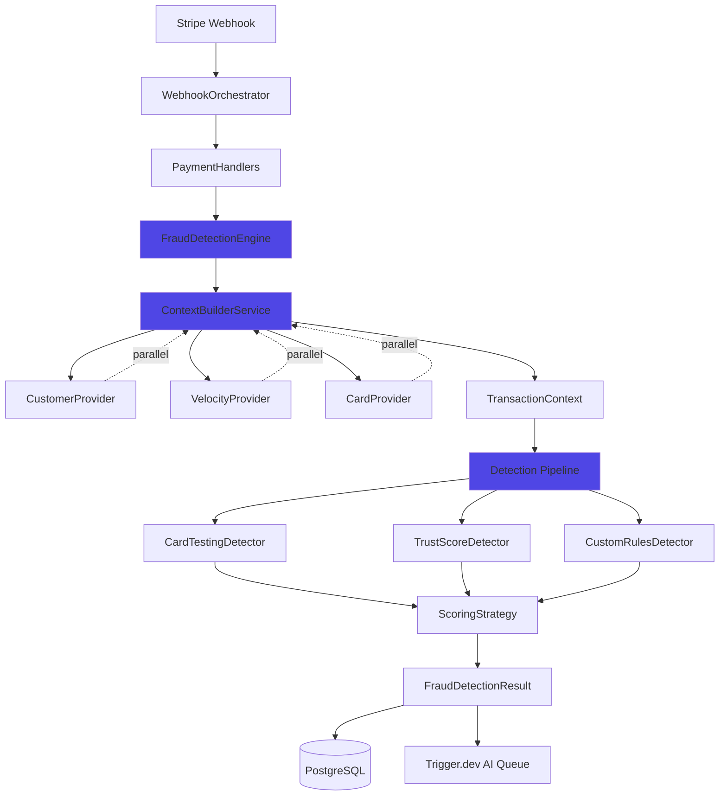

# Orylo V2 - Architecture Refonte Système Détection de Fraude

---

## Introduction

Ce document définit l'approche architecturale pour **refondre complètement** le système de détection de fraude d'Orylo V2, en transformant l'architecture monolithique actuelle en une architecture modulaire, testable, et performante. Il sert de blueprint architectural pour le développement piloté par IA tout en garantissant une intégration transparente avec le système existant.

### Scope Assessment - Justification d'une Architecture Complète

✅ **Architecture Brownfield Complète Justifiée** - Cette refonte nécessite une planification architecturale approfondie :

**Complexité du Changement** :
- **Volume de Code Impacté** : ~5,500 lignes de code critique (1,251 lignes webhook handlers + 4,200 lignes fraud detection modules)
- **Composants Critiques Affectés** : 11 modules de détection + webhook orchestration + système de scoring
- **Impact Architectural** : Transformation complète du pattern de détection, du flow de données, et de l'orchestration
- **Risque Business** : 🔴 **CRITIQUE** - Système de production gérant transactions financières réelles, 0% de downtime acceptable

**Inputs Disponibles** :
- ✅ **PRD Complet** : `docs/prd.md` (1,302 lignes) - 15 FR + 10 NFR détaillés
- ✅ **Architecture Existante** : `docs/architecture.md` v1.1 - Analyse brownfield complète
- ✅ **Codebase Accessible** : Projet complet analysable via IDE
- ✅ **Documentation Technique** : Rules files (`.cursor/rules/`), schemas DB, API docs

**Relationship to Existing Architecture** :
Ce document **remplace** l'architecture actuelle du système de détection de fraude tout en **préservant** les patterns établis pour l'authentification, le billing, et l'UI. Il définit une nouvelle architecture modulaire qui s'intègre dans l'écosystème Next.js/Vercel existant.

---

## Existing Project Analysis

### Current Project State

**Orylo V2** est une **plateforme SaaS de détection de fraude** pour marchands Stripe, spécialisée dans la détection des attaques de **card testing**. Le système analyse les transactions Stripe en temps réel via webhooks, applique un moteur de règles basé sur des scores, génère des explications IA, et prend des actions automatiques (blocage, alertes).

**Current Architecture Pattern** : **Event-Driven Monolithic**
- Webhooks Stripe déclenchent un handler monolithique
- Traitement séquentiel avec dépendances implicites
- Logique métier couplée avec IO et side-effects

**Primary Purpose** : Détecter et prévenir les attaques de card testing sur Stripe Connect merchants en temps réel

**Current Tech Stack Summary** :
- **Runtime** : Node.js 18+ (Vercel Serverless)
- **Framework** : Next.js 16.1.1 (App Router)
- **Language** : TypeScript 5.x (strict mode)
- **Package Manager** : **Bun 1.2.3** (**CRITIQUE**)
- **Database** : PostgreSQL (Neon Serverless) + Drizzle ORM 0.45.1
- **Auth** : Better Auth 1.4.9 (NOT NextAuth)
- **AI** : Mastra AI SDK 0.24.9 + OpenAI gpt-4o-mini
- **Payments** : Stripe 20.1.0 (Connect API)
- **UI** : Tailwind CSS v4 + Shadcn/ui

**Architecture Style** : 
- **Pattern** : Serverless Event-Driven
- **Code Organization** : Monolithic handlers avec fonctions utilitaires
- **Data Flow** : Séquentiel, bloquant
- **State Management** : Database-centric (PostgreSQL via Drizzle)

**Deployment Method** : 
- **Platform** : Vercel (Edge Runtime)
- **Environments** : Production + Preview
- **CI/CD** : Git push → Vercel auto-deploy
- **Monitoring** : Vercel Analytics + tslog structured logging

### Available Documentation

**Documentation Existante (Excellente Qualité)** :

- ✅ **Architecture Document** : `docs/architecture.md` v1.1 (1,312 lignes) - Analyse brownfield complète avec tech stack, patterns, workarounds documentés
- ✅ **PRD Complet** : `docs/prd.md` v1.0 (1,302 lignes) - Requirements détaillés pour cette refonte
- ✅ **Coding Standards** : `.cursor/rules/` (8 fichiers) - Patterns Next.js, DB conventions, auth patterns, routing
- ✅ **Database Schemas** : `lib/db/schemas/` (25 fichiers) - Tous les modèles Drizzle avec relations
- ✅ **API Patterns** : `docs/architecture.md` - Section "API Specifications" + Server Actions patterns
- ✅ **Technical Debt** : `docs/architecture.md` - 5 workarounds documentés dans le système actuel
- ❌ **Test Documentation** : Aucun test existant (0% coverage) - À créer dans cette refonte

**Qualité de la Documentation** : Excellente - Documentation récente (8 janvier 2026), détaillée, avec diagrammes Mermaid et debt tracking.

### Identified Constraints

**Contraintes Techniques Non-Négociables** :

1. **Runtime Serverless** : Vercel Edge Runtime - Pas de long-running processes, timeouts stricts (10s pour Edge, 60s pour Serverless Functions)
2. **Package Manager Bun** : **CRITIQUE** - Toujours utiliser `bun` (jamais npm/yarn/pnpm) pour compatibilité avec les lockfiles existants
3. **Database Neon Serverless** : Connection pooling géré par Neon, pas de connexions persistantes
4. **Multi-Tenancy via Organizations** : Better Auth Organizations - Toutes les queries doivent filtrer par `organizationId`
5. **Stripe Connect Architecture** : Chaque organization a son propre Stripe Connected Account avec webhooks séparés
6. **0% Downtime Requirement** : Migration progressive obligatoire avec feature flags et rollback capability
7. **Performance Targets** : Webhook processing < 2s (actuel : 1-2s, objectif post-refonte : < 1s)
8. **Backwards Compatibility** : APIs internes et schémas DB doivent rester compatibles pendant la migration

**Contraintes Business** :

1. **Production Critical System** : Système déjà en production avec vrais clients et transactions financières
2. **Security First** : Système manipule des données financières (PCI-DSS awareness), authentification multi-tenant stricte
3. **Cost Consciousness** : Optimiser coûts Vercel (function invocations), OpenAI (tokens AI), et Neon (queries DB)

### Change Log

| Date | Version | Description | Author |
|------|---------|-------------|--------|
| 2026-01-08 | 2.0 | Architecture brownfield pour refonte complète fraud detection | Winston (Architect) |

---

## Enhancement Scope and Integration Strategy

### Enhancement Overview

**Enhancement Type** : Refonte Architecturale Multi-Facettes
- ✅ **Major Feature Modification** - Transformation complète du moteur de détection
- ✅ **Performance/Scalability Improvements** - Réduction latence 30-50%, parallélisation, cache
- ✅ **Technology Stack Upgrade** - Architecture interne modulaire avec patterns avancés
- ✅ **Bug Fix and Stability Improvements** - Élimination 5 workarounds + test coverage 0% → 80%+

**Scope** : Refonte architecturale complète des systèmes de webhook handling et fraud detection

**Portée Détaillée** :
1. **Décomposition Webhook Handler Monolithique** :
   - Fichier `lib/actions/stripe-webhook-handlers.ts` (1,251 lignes) → Modules à responsabilité unique
   - Handler `handlePaymentIntentCreated()` (350 lignes, 8 STEPS) → Orchestrator + Domain handlers
   - 15+ handlers Stripe différents → Architecture event-driven modulaire

2. **Refonte Moteur de Détection** :
   - `lib/fraud-detection/engine.ts` (492 lignes) → Pluggable Detection Pipeline
   - Score additif simpliste → Système de règles sophistiqué avec priorités
   - 15 règles hardcodées → Architecture extensible avec règles custom
   - Pas de corrélation → Analyse contextuelle avec machine learning

3. **Ajout Testabilité Complète** :
   - 0% coverage actuel → 80%+ coverage target
   - Dependency Injection pattern avec interfaces
   - Test framework (Vitest) + mocking strategy
   - Tests unitaires + intégration + E2E

4. **Optimisation Performances** :
   - Queries DB séquentielles → Parallélisation (Promise.all)
   - Pas de cache → Cache multi-niveau (Memory + Redis optionnel)
   - AI bloquante → AI asynchrone avec Trigger.dev
   - Latence 1-2s → Target < 1s

5. **Amélioration Maintenabilité** :
   - Code implicite → Documentation JSDoc complète + ADRs
   - Logique mélangée → Separation of concerns stricte
   - Pas d'observabilité → Structured logging + métriques + tracing

**Integration Impact Level** : 🔴 **MAJOR IMPACT**

- **Codebase** : ~5,500 lignes à refactoriser (20% du code fraud-related)
- **Architecture** : Transformation pattern monolithic → modular + event-driven
- **Data Flow** : Séquentiel bloquant → Parallèle + asynchrone
- **Dependencies** : Nouvelles (Trigger.dev, Vitest, Redis optionnel)
- **Risk** : Élevé - Système production critique, migration Strangler Fig obligatoire

### Integration Approach

#### Code Integration Strategy

**Pattern de Migration : Strangler Fig Pattern**

La refonte suivra le pattern **Strangler Fig** pour migration progressive sans downtime :

**Phase 1 : New Code Alongside Old (Sprint 1-2)** :
- Créer nouvelle architecture dans `lib/fraud-detection-v2/` et `lib/webhook-handlers-v2/`
- Ancienne architecture reste active dans `lib/fraud-detection/` et `lib/actions/stripe-webhook-handlers.ts`
- Feature flag `ENABLE_V2_FRAUD_DETECTION` pour toggle entre V1 et V2
- Tests E2E comparent V1 vs V2 pour vérifier équivalence comportementale

**Phase 2 : Gradual Traffic Migration (Sprint 3-4)** :
- Rollout progressif avec Vercel Split Testing : 1% → 5% → 25% → 50% → 100%
- Monitoring intensif : latence, accuracy, error rates
- Rollback automatique si métriques dégradées (latence > 2s, error rate > 1%)
- Shadow mode : V2 s'exécute en parallèle de V1 pour validation (sans impact décision)

**Phase 3 : Old Code Removal (Sprint 5)** :
- Une fois V2 à 100% et stable pendant 1 semaine :
  - Supprimer `lib/fraud-detection/` (old engine)
  - Supprimer handlers monolithiques de `lib/actions/stripe-webhook-handlers.ts`
  - Renommer `lib/fraud-detection-v2/` → `lib/fraud-detection/`
  - Cleanup feature flags

**Coexistence Strategy** :
```typescript
// app/api/webhooks/stripe/[accountId]/route.ts
import { detectFraudV1 } from '@/lib/fraud-detection/engine';
import { detectFraudV2 } from '@/lib/fraud-detection-v2/engine';

const fraudResult = process.env.ENABLE_V2_FRAUD_DETECTION === 'true'
  ? await detectFraudV2(context)
  : await detectFraudV1(context);
```

**Code Organization** :
- **Modules nouveaux** : Tous dans `lib/fraud-detection-v2/`, `lib/webhook-handlers-v2/`
- **Shared utilities** : Factoriser dans `lib/fraud-detection/shared/` (utilisé par V1 et V2)
- **Tests** : Miroir de la structure code (`__tests__/` à côté de chaque module)

#### Database Integration

**Schema Compatibility Strategy : Backward Compatible Extensions**

**Principe** : Schémas DB restent **100% backward compatible** pendant toute la migration.

**Approche** :
1. **Pas de modification destructive** : Aucune suppression/renommage de colonnes existantes
2. **Additive changes only** : Nouveaux champs optionnels (nullable) uniquement
3. **V1 et V2 partagent les mêmes tables** : Pas de duplication de données

**Changements DB Nécessaires** :

**Table `fraud_detections`** (Ajouts uniquement) :
```sql
-- Nouveaux champs pour V2 (tous nullable pour compatibilité V1)
ALTER TABLE fraud_detections 
  ADD COLUMN detection_version VARCHAR(10),  -- 'v1' ou 'v2'
  ADD COLUMN pipeline_metrics JSONB,         -- Métriques pipeline V2
  ADD COLUMN rule_execution_details JSONB;   -- Détails exécution règles V2
```

**Nouvelle Table `fraud_detection_cache`** (Pour cache V2) :
```sql
CREATE TABLE fraud_detection_cache (
  id TEXT PRIMARY KEY,
  cache_key TEXT NOT NULL,
  cache_value JSONB NOT NULL,
  expires_at TIMESTAMP NOT NULL,
  created_at TIMESTAMP DEFAULT NOW()
);
CREATE INDEX idx_cache_key_expires ON fraud_detection_cache(cache_key, expires_at);
```

**Migration Strategy** :
- **Drizzle migrations** : Générer avec `bun run db:generate`, appliquer avec `bun run db:migrate`
- **Zero downtime** : Migrations additives appliquées en production sans interruption
- **Rollback** : Colonnes ajoutées peuvent être ignorées si rollback vers V1

#### API Integration

**Internal API Strategy : Transparent Compatibility**

**Principe** : Les Server Actions et API Routes **ne changent PAS** leur signature externe pendant la migration.

**Server Actions (`lib/actions/`)** :
- `fraud-analyses.ts` : Signature inchangée, implémentation interne switch V1/V2
- `rules.ts` : Extension pour nouvelles règles V2, backward compatible avec règles V1
- `stripe-webhook-handlers.ts` : Refactoré en modules, mais exports publics identiques

**Exemple de compatibilité** :
```typescript
// lib/actions/fraud-analyses.ts - API INCHANGÉE
export async function analyzeFraudDetection(organizationId: string, detectionId: string) {
  // Implémentation interne détecte V1 ou V2 et s'adapte
  const detection = await db.query.fraudDetections.findFirst({
    where: eq(fraudDetections.id, detectionId)
  });
  
  if (detection.detection_version === 'v2') {
    return formatV2Detection(detection);
  }
  return formatV1Detection(detection); // Backward compat
}
```

**External APIs** :
- **Stripe Webhooks** : Signature inchangée (`POST /api/webhooks/stripe/[accountId]`)
- **Response format** : Identique pour compatibilité Stripe
- **Internal processing** : V2 engine transparent pour Stripe

#### UI Integration

**Frontend Strategy : Zero UI Changes Required**

**Principe** : La refonte est **backend-only**, aucun changement UI nécessaire pendant la migration.

**Dashboard Pages (`components/dashboard/pages/`)** :
- **fraud-analyses-page.tsx** : Aucune modification requise
- **rules-page.tsx** : Extension pour afficher nouvelles règles V2, mais compatible V1
- **analytics-page.tsx** : Affiche métriques V1 et V2 de manière unifiée

**Affichage V2-specific** (Post-migration complète) :
- Nouveaux champs `pipeline_metrics` et `rule_execution_details` affichés dans UI
- Section "Detection Version" affiche V1 vs V2 pour audit
- Métriques de performance comparatives V1 vs V2

**No Breaking Changes** :
- Tous les composants existants fonctionnent avec V1 et V2
- Pas de refactoring UI requis pour la migration
- Améliorations UI optionnelles après stabilisation V2

### Compatibility Requirements

#### Existing API Compatibility

**Garanties** :
- ✅ **100% backward compatible** : Toutes les Server Actions gardent leur signature
- ✅ **Response format stable** : Schémas de retour identiques (sauf extensions optionnelles)
- ✅ **Error handling consistent** : Codes d'erreur et messages inchangés
- ✅ **Webhook responses** : Stripe webhook responses identiques (HTTP 200 + logs)

**Validation** :
- Tests d'intégration comparent V1 vs V2 pour mêmes inputs
- Contract testing pour garantir stabilité des contrats API
- Monitoring des error rates pour détecter régressions

#### Database Schema Compatibility

**Garanties** :
- ✅ **Additive only** : Aucune suppression/modification de colonnes existantes
- ✅ **Nullable new fields** : Tous nouveaux champs sont nullable
- ✅ **V1 continue to work** : V1 ignore nouveaux champs, fonctionne normalement
- ✅ **Shared tables** : V1 et V2 écrivent dans mêmes tables

**Migration Safety** :
- Migrations Drizzle testées en staging avant production
- Rollback plan : Nouveaux champs ignorés si rollback
- Backup DB avant chaque migration majeure

#### UI/UX Consistency

**Garanties** :
- ✅ **No UI changes** : Interface utilisateur inchangée pendant migration
- ✅ **Design system respect** : Nouveaux composants (post-migration) suivent Shadcn/ui + Tailwind patterns
- ✅ **User experience** : Aucun impact sur workflows utilisateurs pendant migration
- ✅ **Performance perceptible** : Utilisateurs voient amélioration latence (webhook plus rapide)

#### Performance Impact

**Targets** :
- ✅ **Latence webhook** : < 1s (vs 1-2s actuel) = **Amélioration 30-50%**
- ✅ **DB queries** : Réduction 40-60% via parallélisation et cache
- ✅ **AI processing** : Non-bloquant avec Trigger.dev, 0ms impact webhook
- ✅ **Memory footprint** : Cache in-memory léger (<50MB), Redis optionnel si nécessaire

**Performance Monitoring** :
- Métriques Vercel Analytics : Latence P50, P95, P99
- Structured logging : Temps par étape du pipeline
- Alerting : Si latence > 2s ou error rate > 1%

---

## Tech Stack

### Existing Technology Stack

Le projet utilise un stack moderne Next.js/Vercel avec les technologies suivantes **qui doivent être préservées** :

| Category | Current Technology | Version | Usage in Enhancement | Notes |
|----------|-------------------|---------|---------------------|-------|
| **Runtime** | Node.js (Vercel) | 18+ | Inchangé | Serverless, timeouts 10s Edge / 60s Functions |
| **Framework** | Next.js | 16.1.1 | Inchangé | App Router (NOT Pages Router) |
| **Language** | TypeScript | 5.x | Inchangé | Strict mode obligatoire |
| **Package Manager** | **Bun** | 1.2.3 | **CRITIQUE** | **TOUJOURS utiliser bun** (jamais npm/yarn/pnpm) |
| **Database** | PostgreSQL (Neon) | Serverless | Inchangé | Connection pooling géré par Neon |
| **ORM** | Drizzle ORM | 0.45.1 | Inchangé | Avec drizzle-zod pour validation |
| **Auth** | Better Auth | 1.4.9 | Inchangé | Organizations plugin (NOT NextAuth) |
| **Billing** | Autumn.js | 0.1.63 | Inchangé | Usage-based billing |
| **Payments** | Stripe SDK | 20.1.0 | Inchangé | Connect API multi-tenant |
| **AI/ML** | Mastra AI SDK | 0.24.9 | Inchangé | Agents pour explications |
| **AI Provider** | OpenAI | gpt-4o-mini | Inchangé | Via @ai-sdk/openai |
| **State Management** | TanStack Query | 5.90.16 | Inchangé | Server state |
| **Forms** | TanStack Form | 1.27.7 | Inchangé | Form handling |
| **UI Framework** | Tailwind CSS | v4 | Inchangé | Avec CVA |
| **UI Components** | Shadcn/ui | Custom | Inchangé | Dans /components/ui |
| **Icons** | Phosphor + Lucide | 2.1.10 | Inchangé | Icon libraries |
| **Logging** | tslog | 4.10.2 | Inchangé | Structured logging |

### New Technology Additions

Les technologies suivantes seront ajoutées pour supporter la refonte :

| Technology | Version | Purpose | Rationale | Integration Method |
|-----------|---------|---------|-----------|-------------------|
| **Vitest** | ^2.1.0 | Test framework | Best-in-class pour TypeScript/Next.js, fast, excellent DX | `bun add -D vitest @vitest/ui` |
| **@testing-library/react** | ^16.0.0 | React component testing | Standard industry, bon support Vitest | `bun add -D @testing-library/react` |
| **@testing-library/jest-dom** | ^6.6.0 | DOM matchers | Matchers pratiques pour tests | `bun add -D @testing-library/jest-dom` |
| **Trigger.dev** | ^3.0.0 | Background jobs async | Serverless-native, excellent DX, built-in retry, monitoring | `bun add @trigger.dev/sdk` |
| **Upstash Redis** (optionnel V2) | Latest | Distributed cache | Serverless Redis, pricing par request, Vercel integration | `bun add @upstash/redis` (optionnel) |

---

## Data Models and Schema Changes

### New Data Models

#### Table: `fraud_detection_cache` (Nouveau)

**Purpose** : Cache distribué pour customer scores, velocity metrics, et custom rules

```typescript
// lib/db/schemas/fraudDetectionCache.ts
export const fraudDetectionCache = pgTable("fraud_detection_cache", {
  id: text("id").primaryKey().$defaultFn(() => crypto.randomUUID()),
  cacheKey: text("cache_key").notNull(),
  cacheValue: jsonb("cache_value").notNull(),
  expiresAt: timestamp("expires_at").notNull(),
  createdAt: timestamp("created_at").defaultNow().notNull(),
}, (table) => [
  index("idx_cache_key_expires").on(table.cacheKey, table.expiresAt),
]);
```

#### Extensions: `fraud_detections` (Modifications additives)

```sql
ALTER TABLE fraud_detections 
  ADD COLUMN detection_version VARCHAR(10),
  ADD COLUMN pipeline_metrics JSONB,
  ADD COLUMN rule_execution_details JSONB;
```

**Backward Compatibility** : Toutes colonnes nullable, V1 continue sans les remplir

---

## Component Architecture

### New Components Overview

1. **FraudDetectionEngine** : Orchestration pipeline, exécution detectors
2. **ContextBuilderService** : Context builder parallélisé
3. **Pluggable Detectors** : CardTesting, TrustScore, Custom, Geographic, Velocity
4. **WebhookOrchestrator** : Router events vers handlers spécialisés
5. **CacheService** : Cache layer (Memory + Redis optionnel)

### Component Interaction Diagram



---

## Source Tree

### New File Organization

```
lib/
  ├── fraud-detection-v2/              # 🆕 NOUVELLE ARCHITECTURE
  │   ├── core/
  │   │   ├── engine.ts
  │   │   ├── interfaces.ts
  │   │   └── types.ts
  │   ├── detectors/
  │   │   ├── card-testing.detector.ts
  │   │   ├── trust-score.detector.ts
  │   │   ├── custom-rules.detector.ts
  │   │   ├── geographic.detector.ts
  │   │   └── velocity.detector.ts
  │   ├── services/
  │   │   ├── context-builder.service.ts
  │   │   ├── cache.service.ts
  │   │   └── providers/
  │   └── __tests__/
  ├── webhook-handlers-v2/
  │   ├── orchestrator.ts
  │   ├── handlers/
  │   │   ├── payment.handlers.ts
  │   │   ├── charge.handlers.ts
  │   │   └── customer.handlers.ts
  │   └── __tests__/
  └── fraud-detection/                 # ✅ LEGACY (preserved)
```

---

## Infrastructure and Deployment

### Deployment Strategy: Gradual Rollout

**Phase 1** : Deploy V2 code (Shadow Mode, disabled)
**Phase 2** : Enable Shadow Mode (V2 parallel V1, no impact)
**Phase 3** : Gradual rollout 1% → 5% → 25% → 50% → 100%
**Phase 4** : Cleanup (remove V1 code)

### Environment Variables

```bash
ENABLE_V2_FRAUD_DETECTION=false
ENABLE_V2_SHADOW_MODE=false
TRIGGER_API_KEY=<key>
UPSTASH_REDIS_REST_URL=<url>  # Optionnel
```

### Rollback Strategy

**Method** : Feature flag toggle (instant)  
**Triggers** : Latence > 2s, Error rate > 1%, Agreement < 95%  
**Procedure** : Set `ENABLE_V2_FRAUD_DETECTION=false` → Redeploy (< 2min)

---

## Coding Standards

### Enhancement-Specific Standards

1. **Dependency Injection Obligatoire** : Constructor injection pour testabilité
2. **Interface-First Design** : Définir interfaces avant implémentations
3. **JSDoc Complet** : Documenter toutes APIs publiques
4. **Error Handling Explicite** : Typed errors, explicit handling
5. **Repository Pattern** : Abstraire DB access
6. **Never Fail Webhooks** : Toujours retourner HTTP 200
7. **Structured Logging** : tslog, jamais console.log

---

## Testing Strategy

### Coverage Targets

- **Core Engine** : 90%+
- **Detectors** : 85%+ each
- **Services** : 80%+
- **Handlers** : 75%+

### Test Organization

```
lib/fraud-detection-v2/
  ├── core/
  │   ├── engine.ts
  │   └── __tests__/
  │       └── engine.test.ts
  └── detectors/
      ├── card-testing.detector.ts
      └── __tests__/
          └── card-testing.detector.test.ts
```

### Regression Testing

```typescript
// V1 vs V2 agreement tests (shadow mode validation)
describe('V1 vs V2 Regression', () => {
  it('should match V1 decisions for known cases', async () => {
    const v1Result = await detectFraudV1(context);
    const v2Result = await detectFraudV2(context);
    expect(v2Result.decision).toBe(v1Result.decision);
  });
});
```

---

## Security Integration

### Security Measures

1. **Multi-Tenant Isolation** : Toujours filtrer par `organizationId`
2. **Webhook Verification** : Stripe signature verification
3. **Input Validation** : Zod schemas pour toutes entrées
4. **Authorization Checks** : Dans repositories, pas dans business logic

### Security Testing

```typescript
describe('Multi-Tenant Isolation', () => {
  it('should not allow cross-org access', async () => {
    const detection = await repo.findById(id, org2Id);
    expect(detection).toBeNull(); // Org1 detection not accessible by Org2
  });
});
```

---

## Next Steps

### Story Manager Handoff

**Pour Sarah (PO)** :

Créez stories détaillées basées sur :
- **PRD** : `docs/prd.md` (15 FR + 10 NFR)
- **Architecture** : Ce document
- **Pattern** : Strangler Fig, migration progressive
- **First Story** : Story 1.1 - Setup Testing Infrastructure

**Séquence** :
- Phase 1 (Week 1-2) : Foundation (Testing + Interfaces)
- Phase 2 (Week 3-6) : Core (Context Builder + Engine)
- Phase 3 (Week 7-9) : Handlers (Webhook Decomposition)
- Phase 4 (Week 10-12) : Migration (Shadow Mode + Rollout)

### Developer Handoff

**Pour James & Dev Team** :

**Start Here** :
1. Story 1.1 : Setup Vitest + mocks
2. Story 1.2 : Create core interfaces
3. Follow architecture patterns définis ci-dessus

**Critical Rules** :
- ✅ V2 code dans `lib/fraud-detection-v2/`
- ✅ Ne PAS toucher V1 code pendant Phase 1-3
- ✅ Tests obligatoires (80%+ coverage)
- ✅ Feature flags pour routing V1/V2

**References** :
- Architecture : Ce document (source of truth)
- Coding Standards : `.cursor/rules/` + section ci-dessus
- PRD : `docs/prd.md`

---

## Change Log

| Date | Version | Description | Author |
|------|---------|-------------|--------|
| 2026-01-08 | 2.0 | Architecture brownfield complète - Toutes sections | Winston (Architect) |

---
