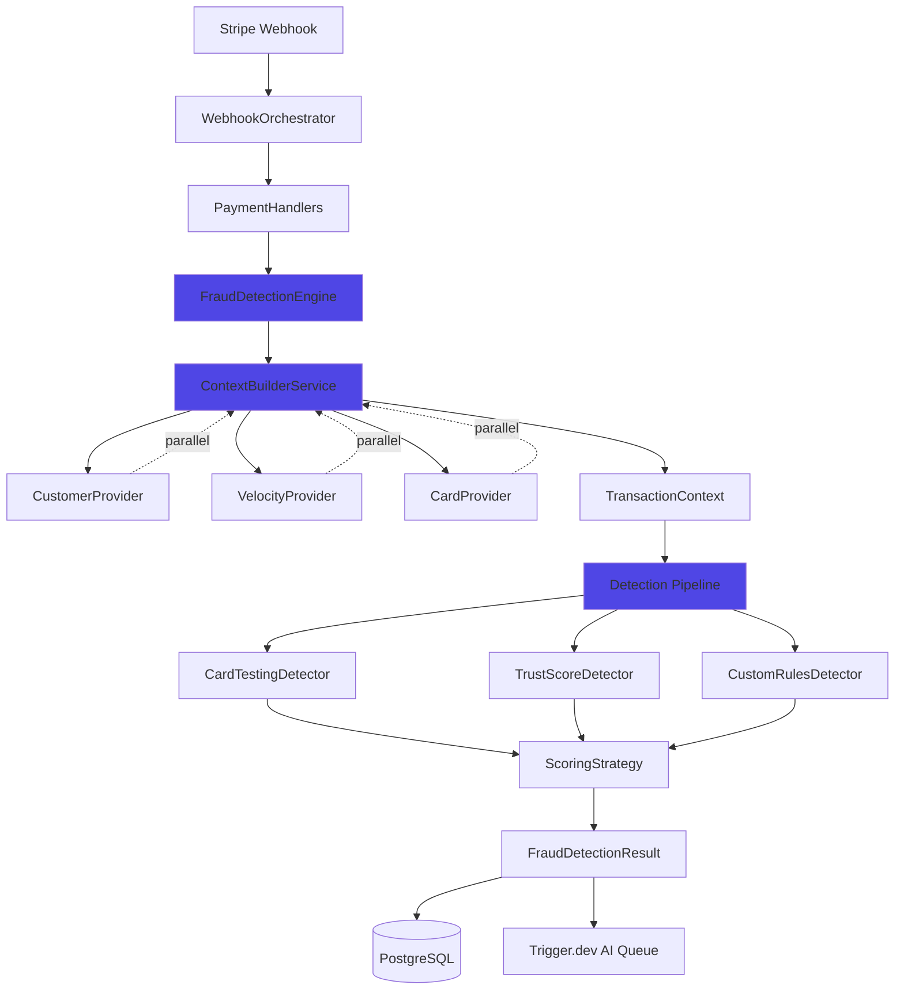

# Component Architecture

### New Components Overview

1. **FraudDetectionEngine** : Orchestration pipeline, exécution detectors
2. **ContextBuilderService** : Context builder parallélisé
3. **Pluggable Detectors** : CardTesting, TrustScore, Custom, Geographic, Velocity
4. **WebhookOrchestrator** : Router events vers handlers spécialisés
5. **CacheService** : Cache layer (Memory + Redis optionnel)

### Component Interaction Diagram

---
